# 🚀 TensorFlow Serving Pipeline with Accuracy-Gated Retraining

[](https://tensorflow.org)
[](https://docker.com)
[](https://github.com/features/actions)
[](https://prometheus.io)
[](LICENSE)

A production-grade machine learning pipeline featuring TensorFlow Serving with Docker, automated retraining with accuracy gates, comprehensive monitoring, and CI/CD integration. Designed for enterprise MLOps workflows.

## 🏆 Features

### 🔥 Core Features
- **Accuracy-Gated Retraining**: Automatic weekly retraining with 97% accuracy threshold
- **TensorFlow Serving**: Production model serving with REST/gRPC APIs
- **Docker Containerization**: Easy deployment and scalability
- **Model Versioning**: Automatic version control with timestamps
- **Rollback Capability**: Quick revert to previous versions on performance degradation

### 🚀 Advanced Features
- **Canary Deployments**: Safe rollout of new models with traffic splitting
- **Comprehensive Monitoring**: Prometheus metrics + Grafana dashboards
- **CI/CD Pipeline**: GitHub Actions for automated testing and deployment
- **Authentication Middleware**: API key-based security
- **Performance Testing**: Load testing and benchmarking suite

## 📊 System Architecture

```mermaid
graph TB
    A[Training Data] --> B[Model Training]
    B --> C{Accuracy ≥97%?}
    C -->|Yes| D[Promote to Production]
    C -->|No| E[Send Alert + Keep Previous]
    D --> F[TensorFlow Serving]
    F --> G[REST API]
    F --> H[gRPC API]
    F --> I[Monitoring]
    I --> J[Prometheus]
    I --> K[Grafana]
    L[CI/CD] --> M[Automated Retraining]
```



## 🛠️ Quick Start

### Prerequisites

- Python 3.8+
- Docker & Docker Compose
- Git

### Installation

1. **Clone the repository**
   ```bash
   git clone https://github.com/Ermi1223/ml-deployment-pipeline.git
   cd ml-deployment-pipeline
   ```

2. **Install dependencies**
   ```bash
   pip install -r requirements.txt
   ```

3. **Train initial model**
   ```bash
   python scripts/train_model.py
   ```

4. **Start services**
   ```bash
   docker-compose -f docker/docker-compose.yml up -d
   ```

5. **Test the API**
   ```bash
   python tests/test_rest_api.py
   ```

## 📁 Project Structure

```
mnist-serving-pipeline/
├── models/                 # Model versions and metrics
├── scripts/               # Core implementation scripts
│   ├── train_model.py     # Model training and export
│   ├── retrain_pipeline.py # Accuracy-gated retraining
│   ├── canary_test.py     # Canary deployment testing
│   └── monitor_metrics.py # Monitoring and alerting
├── docker/               # Docker configuration
│   ├── Dockerfile.tf_serving
│   ├── docker-compose.yml
│   └── monitoring.config
├── monitoring/           # Monitoring setup
│   ├── prometheus.yml
│   └── grafana/
├── tests/               # Comprehensive test suite
│   ├── test_rest_api.py
│   ├── test_grpc_api.py
│   └── test_model_performance.py
├── config/              # Configuration files
│   ├── model_config.json
│   └── auth_config.json
├── .github/workflows/   # CI/CD pipelines
│   ├── weekly_retrain.yml
│   └── ci_cd.yml
└── docs/                # Documentation
    └── API_DOCUMENTATION.md
```

## 🎯 Usage Examples

### REST API Request

```bash
curl -X POST http://localhost:8501/v1/models/mnist:predict \
  -H "Content-Type: application/json" \
  -d '{
    "instances": [
        [[[0.0], [0.0], ...]]  # 28x28x1 array
    ]
}'
```

### Python Client

```python
import requests
import json
import numpy as np

def predict(image_data):
    payload = json.dumps({"instances": [image_data.tolist()]})
    headers = {'Content-Type': 'application/json'}
    response = requests.post(
        'http://localhost:8501/v1/models/mnist:predict',
        data=payload, headers=headers
    )
    return response.json()

# Example usage
sample = load_your_image_data()  # 28x28x1 numpy array
result = predict(sample)
print(f"Prediction: {np.argmax(result['predictions'][0])}")
```

### Manual Retraining

```bash
python scripts/retrain_pipeline.py --min-accuracy 0.97
```

## 📊 Monitoring & Observability

Access monitoring dashboards:

- **Grafana**: http://localhost:3000 (admin/admin)
- **Prometheus**: http://localhost:9090
- **TF Serving Metrics**: http://localhost:8501/monitoring/prometheus/metrics

Key metrics monitored:
- Request rate and latency distribution
- Error rates and status codes
- Model version performance
- System resource utilization

## 🔧 Configuration

### Model Settings

Edit `config/model_config.json`:
```json
{
  "model_config_list": [
    {
      "config": {
        "name": "mnist",
        "base_path": "/models/mnist",
        "model_platform": "tensorflow",
        "model_version_policy": {
          "specific": {
            "versions": [1682755200, 1683360000]
          }
        }
      }
    }
  ]
}
```

### Authentication Setup

Configure API keys in `config/auth_config.json`:
```json
{
  "api_keys": {
    "client_1": "your-api-key-here",
    "client_2": "another-api-key"
  },
  "rate_limits": {
    "client_1": 1000,
    "client_2": 100
  }
}
```

## 🚀 CI/CD Pipeline

The GitHub Actions workflow provides:

- **Automated testing** on every commit
- **Weekly retraining** with accuracy gating
- **Automated deployment** on success
- **Performance validation** before promotion
- **Notification system** for failures

View workflow in `.github/workflows/ci_cd.yml`

## 🧪 Testing

Run the comprehensive test suite:

```bash
# Run all tests
pytest tests/

# Specific test groups
python tests/test_rest_api.py
python tests/test_grpc_api.py  
python tests/test_model_performance.py

# Canary testing
python scripts/canary_test.py
```

## 📈 Performance Benchmarks

Typical performance metrics:
- **Throughput**: 100+ requests/second
- **P95 Latency**: < 100ms
- **Accuracy**: > 97% on MNIST test set
- **Availability**: 99.9% uptime

## 🔍 Troubleshooting

### Common Issues

1. **Model not loading**
   ```bash
   docker logs tf_serving_mnist
   ```

2. **Port conflicts**
   ```bash
   lsof -i :8501  # Check port usage
   ```

3. **Accuracy gate failures**
   - Check training data quality
   - Verify preprocessing consistency

### Getting Help

1. Check container logs: `docker-compose logs`
2. Verify model endpoints: `curl http://localhost:8501/v1/models/mnist`
3. Test connectivity: `python tests/test_rest_api.py`

## 🤝 Contributing

We welcome contributions! Please see our [Contributing Guide](CONTRIBUTING.md) for details.

1. Fork the repository
2. Create a feature branch: `git checkout -b feature/amazing-feature`
3. Commit changes: `git commit -m 'Add amazing feature'`
4. Push to branch: `git push origin feature/amazing-feature`
5. Open a Pull Request

## 📄 License

This project is licensed under the MIT License - see the [LICENSE](LICENSE) file for details.

## 🙏 Acknowledgments

- TensorFlow Serving team for the excellent serving infrastructure
- Prometheus and Grafana communities for monitoring tools
- MNIST dataset providers for the benchmark dataset

## 📞 Support

For support, please open an issue on GitHub or contact at ermi1223b@gmail.com

